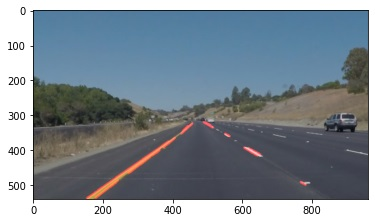
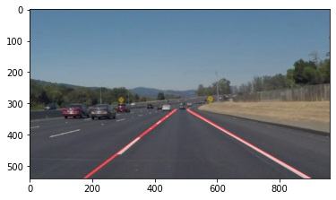

# Finding Lane Lines on the Road
#### Submitted by Cristian Alberch as part of Udacity Self Driving Car Engineering Nanodegree - December 2020

### Overview
When we drive, we use our eyes to decide where to go. The lines on the road that show us where the lanes are act as our constant reference for where to steer the vehicle. Naturally, one of the first things we would like to do in developing a self-driving car is to automatically detect lane lines using an algorithm.

This is an project is will detect lane lines in video images in a rudimentary manner using Python and OpenCV. The process followed are discussed together with improvements needed.

### Process

The pipeline consists of the following steps:
The video image processing pipeline consists of:

1. Images from .mp4 video are individually distilled and fed into an image processing pipeline.
2. Canny processing of image in color to detect image edges.
3. Gaussian blur to smooth the edges.
4. Region of interest limits the area of edges detected in image. 
5. Hough transform weas applied to detect lines within the image. This resulted in multiple lines representing a single curve.
6. Curve fitting was applied by:
    - Determine which lines generated from Hough algorithm are located in the left or right lane depending on the slope of the line.
    - Determine the median of the slopes.
    - Apply a line with the median of the slope starting from the bottom of the frame until the vanishing point.
7. The curves are overlayed to the image.

### Results & Discussion
- Canny algorithm:
The image processing was done fully in colour without converting to grey scale as is usual prior to applying Canny algorithm. This yielded satisfactory results.
- Gaussian blur: A smaller kernel size yielded much better results, probably due to processing in color.
- Region of interest vertices are static and were selected based on the expected vehicle visibility of lanes. As the vertices are fixed, this severly limits the range of lane detection.

- Applying the Hough Transform in the region of interest resulted in satisfactory identification of lines. This however, means that dashed lines were identified as individual lines.

    

- In order to identify dashed lines as single lines, line fitting was applied by calculating the mean among the individual lines from the Hough transform. Choosing to use the median of the slopes, as opposed to the mean, made a big different to the results. This is understandable as outliers, such as the edges of vehicles or color variations, would heavily impact the overall result. The median helps remove outliers.

    

### Further Work

Below listed are limitations of the pipeline and algorithms used together with possible solutions to explore:

1. The pipeline assumes a linear model for lane detection. This will result in incorrect results when the lane is curved. Polylinear regression models would improve this.

2. The pipeline uses a region of interest in identification of lanes to simplify the image processing. This will result in an incorrect result when the car steers sideways from the region of interest, or when the road significantly changes its vanishing point, in hills for example.

3. The pipeline would incorrectly detect as lanes, markings or objects near the lanes such as crash barriers, or fences. Machine learning algorithms would improve identification of objects.

4. Vehicles positioned at the sides or close to the front of the car could be incorrectly classified as lane markings. Machine learning algorithms would improve identification of objects.

